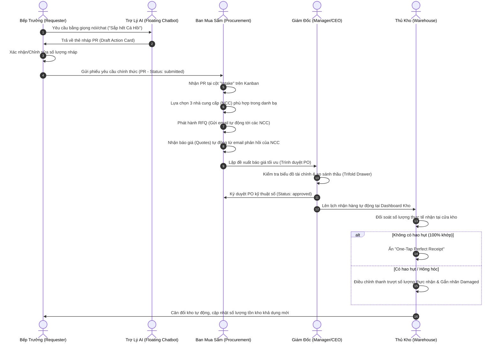

# Bản Đặc Tả Luồng Người Dùng & Dữ Liệu (Detailed User Flow)
## Hệ Thống Thu Mua & Cung Ứng B2B Khép Kín – STALLY PROCUREMENT

Tài liệu này đặc tả chi tiết cách thức người dùng ở từng vai trò tương tác với hệ thống, luồng dữ liệu (Data Path) luân chuyển qua các màn hình và cách xử lý các trường hợp ngoại lệ (Hao hụt/Hỏng hàng/Từ chối phê duyệt).

---

## 🔄 1. Sơ Đồ Luồng Nghiệp Vụ Tổng Quát (End-to-End Workflow)

---

## 🚪 2. Đặc Tả Luồng Đi Chi Tiết Qua Từng Màn Hình (Screen-by-Screen Steps)

### Luồng 1: Đề Xuất Nguyên Vật Liệu (Bếp Trưởng - Requester Flow)
* **Bắt đầu**: Bếp Trưởng đăng nhập vào hệ thống.
* **Bước 1**: Quan sát màn hình Dashboard.
  * Nếu có cảnh báo màu cam ở phần **Low-Stock Alert**, Bếp trưởng click nút "Tạo PR bù" trực tiếp trên cảnh báo.
  * Nếu muốn mua thủ công, Bếp trưởng di chuyển con trỏ chuột tới bảng **Autocomplete Quick Entry**.
* **Bước 2**: Tại bảng nhập liệu nhanh:
  * Nhập ký tự đầu (Ví dụ: `Cá...`), hệ thống hiển thị danh sách gợi ý nguyên vật liệu có sẵn trong kho dữ liệu.
  * Nhấn nút mũi tên/nhấp chọn để chọn sản phẩm.
  * Nhấn `Tab` sang ô Số Lượng, nhập giá trị (Ví dụ: `15`), nhấn `Tab` sang ô Ghi chú.
  * Nhấn `Enter` ➔ Hệ thống tự động tạo dòng mới bên dưới, con trỏ tự động nhảy về ô tìm kiếm sản phẩm mới.
* **Bước 3**: Nhấn nút **Gửi Yêu Cầu**.
  * **Đường đi dữ liệu (Data Path)**: Hệ thống tạo bản ghi `PurchaseRequest` mới với trạng thái `submitted`.
  * Giao diện Bếp trưởng hiển thị thêm 1 dòng ở bảng **Lịch sử phiếu yêu cầu**, nút tiến trình ở bước 1 sáng lên.

---

### Luồng 2: Xử Lý Đấu Thầu & Gửi RFQ (Ban Mua Sắm - Procurement Flow)
* **Bắt đầu**: Nhân viên mua sắm mở màn hình **Quy trình mua sắm (Cases)**.
* **Bước 1**: Nhận diện một thẻ PR mới xuất hiện tại cột **Intake** của bảng Kanban.
* **Bước 2**: Nhấp vào thẻ Case. Màn hình chi tiết **CaseDetailTimeline** mở ra.
* **Bước 3**: Tại Bước 2 (Supplier Selection) của Wizard:
  * Hệ thống tự động lọc ra các Nhà cung cấp đối tác có phân phối sản phẩm trong PR.
  * Nhân viên tích chọn các NCC muốn gửi RFQ (Ví dụ: NCC A, NCC B).
* **Bước 4**: Nhấn nút **Gửi RFQ Đấu Giá**.
  * **Đường đi dữ liệu (Data Path)**: Hệ thống gửi email tự động (thông qua SMTP) chứa link báo giá hoặc file đính kèm tới các NCC đã chọn. Trạng thái Case chuyển sang cột **RFQ Sent** trên Kanban.
* **Bước 5**: Khi các NCC gửi email phản hồi báo giá ➔ Hệ thống (thông qua IMAP poller tự động) bắt email, bóc tách giá (OCR/AI parser) và cập nhật trực tiếp vào cơ sở dữ liệu báo giá (`Quotes`).
  * Trạng thái Case tự động chuyển sang cột **Quotes Received**.
* **Bước 6**: Nhân viên mua sắm so sánh các đơn thầu, lựa chọn nhà cung cấp tốt nhất và nhấn **Trình Duyệt Lên Ban Giám Đốc**. Trạng thái chuyển sang cột **CEO Review**.

---

### Luồng 3: Xem Xét & Phê Duyệt (Giám Đốc - Manager Flow)
* **Bắt đầu**: Giám đốc mở màn hình Dashboard.
* **Bước 1**: Quan sát 2 biểu đồ tài chính (Spending Area Chart & Category Doughnut) để đánh giá tổng quan dòng tiền thu mua hiện tại.
* **Bước 2**: Di chuyển đến danh sách **Hàng chờ phê duyệt PO (PO Approval Queue)**.
* **Bước 3**: Nhấp vào một PO cần duyệt. Ngăn kéo trượt 3 lớp (**Trifold Drawer**) xuất hiện từ bên phải màn hình:
  * *Lớp 1*: Bảng đối so sánh chiết khấu phần trăm giữa các NCC.
  * *Lớp 2*: Bản scan PDF gốc hóa đơn/báo giá do đối tác gửi qua email.
  * *Lớp 3*: Toàn bộ lịch sử trao đổi email đàm phán giảm giá giữa phòng mua sắm và NCC đó.
* **Bước 4**: Nếu thông tin hợp lệ, Giám đốc nhấn nút **Ký Duyệt & Phát Hành PO**.
  * **Đường đi dữ liệu (Data Path)**: Hệ thống đánh dấu PO là `approved`. Gửi email chốt đơn chính thức kèm chữ ký điện tử tới NCC được chọn.
  * Hệ thống tự động tạo 1 lịch trình nhận hàng tương ứng gửi sang phân hệ Kho.

---

### Luồng 4: Tiếp Nhận Hàng & Cân Đối Kho (Thủ Kho - Warehouse Flow)
* **Bắt đầu**: Lô hàng được vận chuyển vật lý đến cửa kho nhà hàng. Thủ kho đăng nhập app.
* **Bước 1**: Nhìn thấy thẻ lô hàng nằm ở cột **Arriving Today (Đến hôm nay)** có màu xanh Mint. Nhấp vào thẻ để mở biểu mẫu đối soát.
* **Bước 2 (Xử lý đối soát số lượng)**:
  * **Trường hợp A (Khớp 100%)**: Thủ kho đối soát thấy số lượng thực tế khớp hoàn toàn với đơn hàng ➔ Nhấn nút **One-Tap Perfect Receipt** ở góc trên cùng.
  * **Trường hợp B (Có lỗi/thiếu hàng)**:
    * Thủ kho dùng bộ tăng giảm (+/-) để hạ số lượng thực nhận xuống (Ví dụ: PO yêu cầu `10kg Cà chua`, nhưng thực tế chỉ nhận được `8kg` lành lặn).
    * Chọn nhãn **Hàng lỗi (Damaged)** hoặc **Thiếu hàng (Shortage)** từ danh sách.
* **Bước 3**: Nhấn **Xác Nhận Nhập Kho**.
  * **Đường đi dữ liệu (Data Path)**: 
    * Hệ thống ghi nhận số lượng thực tế nhận vào bảng `InventoryManager`, cộng trực tiếp vào số lượng tồn kho khả dụng mới.
    * Tạo một bản ghi chênh lệch thất thoát báo cáo về Ban mua sắm để tự động điều chỉnh hóa đơn thanh toán cho NCC ở kỳ sau.
    * Gửi thông báo cập nhật tồn kho mới đến Bếp Trưởng, tắt cảnh báo **Low-Stock Alert** nếu mặt hàng đó đã vượt ngưỡng an toàn.

---

## 🚨 3. Các Luồng Nghiệp Vụ Ngoại Lệ (Exception Flows)

### Trường hợp 1: Giám đốc từ chối phê duyệt PO (PO Rejected Flow)
* Tại màn hình phê duyệt, Giám đốc nhấn nút **Từ Chối (Reject)** và nhập lý do (Ví dụ: *"Ngân sách vượt định mức tháng, yêu cầu đàm phán giảm giá thêm 5%"*).
* **Kết quả**: 
  * Trạng thái Case trên Kanban lập tức quay về cột **Quotes Received** (Đã nhận báo giá).
  * Phòng mua sắm nhận được email thông báo có lời bình của Giám đốc để tiến hành đàm phán lại vòng sau với nhà cung cấp.

### Trường hợp 2: Hàng hóa bị hỏng hóc nghiêm trọng tại cửa kho (Severe Damage Flow)
* Thủ kho phát hiện toàn bộ lô hàng thực phẩm bị rách nát hoặc ôi thiu không thể sử dụng.
* **Thao tác**: 
  * Thủ kho kéo số lượng thực nhận về `0`.
  * Nhấn nút **Từ chối nhận toàn bộ lô hàng (Reject Shipment)** và tải ảnh chụp bằng chứng lên (nếu có).
* **Kết quả**:
  * Trạng thái hàng chuyển thành **Canceled/Returned**.
  * Hệ thống tự động gửi cảnh báo khẩn cấp tới phòng Mua sắm yêu cầu liên hệ NCC đổi trả gấp để tránh đứt gãy vận hành của nhà bếp.
